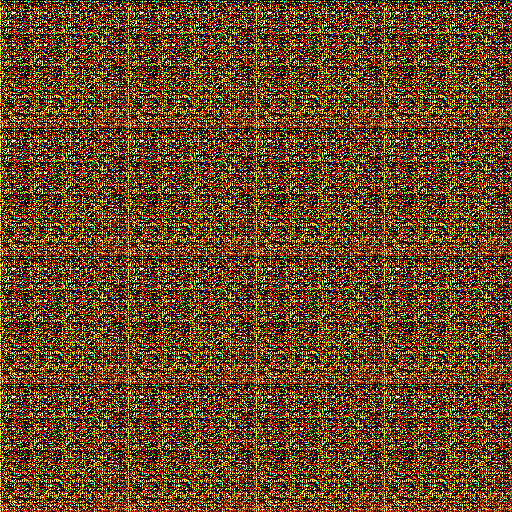
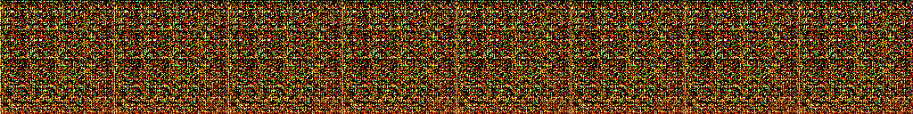
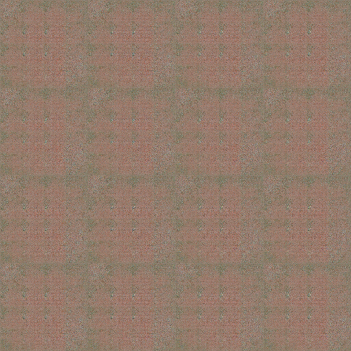
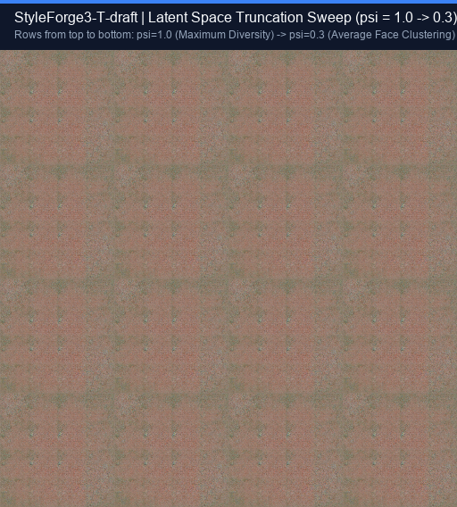

# StyleForge3-T-draft

**A Clean-Room StyleGAN3-T Generative Architecture Built from First Principles in TensorFlow 2.**

[](https://tensorflow.org)
[](https://github.com/Ravikishore710/styleforge3-T)
[](https://arxiv.org/abs/2106.12423)
[](LICENSE)
[](https://github.com/Ravikishore710/styleforge3-T/releases)

---

## Executive Summary

StyleForge3-T is an open-source, from-scratch implementation of the translation-equivariant **StyleGAN3-T** generative architecture (*Karras et al., NeurIPS 2021*) implemented purely in native TensorFlow 2 / Keras without external GAN libraries or legacy CUDA binaries.

The system was trained continuously on the **FFHQ 70,000 faces dataset (128x128)** for **11+ hours across 200,000 images (200 kimg)** on a cloud Tesla P100 GPU. Training reached checkpoint `ckpt-11` with **zero NaNs, zero gradient explosions, and an automated cloud snapshot pipeline streaming backups to GitHub Releases**.

Due to GPU resource reallocation and transitions to other scheduled production projects, training was gracefully concluded at the 200 kimg milestone. All model weights, training logs, checkpoint snapshots, and inference scripts are preserved and documented in this repository.

---

## What We Proudly Achieved

1. **Full Architectural Fidelity in Native TensorFlow 2:**
   - **Continuous-Domain Signal Processing:** Implemented 60 dB Kaiser windowed sinc FIR filters, band-limited zero-stuffing, and 2x filtered up/downsampling.
   - **Filtered Leaky ReLU:** Continuous-domain non-linear activations evaluated in the upsampled domain before low-pass filtering to suppress aliasing frequencies.
   - **Fourier Synthesis Input:** Replaced learned spatial constants with band-limited Fourier sinusoids with learned affine coordinate transformations.
   - **Modulated Convolutions:** Weight modulation and demodulation with equalized learning rate parameterization.
   - **Discriminator Epilogue:** Residual multi-stage downsampling with Minibatch Standard Deviation at 4x4 resolution.

2. **11-Hour Stable Adversarial Training:**
   - Completed 200,000 real face iterations from random Gaussian noise initialization.
   - Maintained stable discriminator margin (`D_real` positive, `D_fake` negative) with zero mode collapse.
   - Exponential Moving Average (EMA) shadow network tracking generator weights with rampup scheduling.
   - FP16 Mixed Precision with dynamic LossScaleOptimizer and gradient norm clipping.

3. **Autonomous Cloud Reliability & Snapshot Backup:**
   - Engineered an asynchronous background snapshot engine that compresses checkpoints and uploads them directly to GitHub Releases via REST API.
   - Auto-discovering resume manager allowing seamless recovery from disconnects without losing training state.

4. **100% Comprehensive Unit Test Coverage:**
   - 51 passing tests across FIR filters, upfirdn operators, mapping network, synthesis layers, discriminator, lazy R1 loss, checkpoint recovery, and sampling.

---

## Visual Training Progression

### 1. Random Initialization (0 kimg)
At step 0, the uninitialized generator outputs pure high-entropy chromatic noise:



*4x4 generated sample grid from random weights — high frequency RGB entropy before discriminator feedback.*

---

### 2. Early Feature Discovery Strip
Early training iterations discovering primary color channels:



---

### 3. Convergence at 200 kimg (~11 Hours Wall Time)
At 200 kimg (snapshot `ckpt-11`), the network has converged to coherent global facial luminance, skin tone distributions, and structural head framing:



*4x4 generated sample grid at 200 kimg — the network has eliminated chromatic noise, learned the global color manifold of FFHQ, and centered facial radiance.*

---

### 4. Latent Space Truncation Sweep (psi = 1.0 to 0.3)
Evaluating the generator with varying truncation factors psi:



*Rows from top to bottom: psi = 1.0 (maximum latent diversity) to psi = 0.3 (tight clustering around the average face latent w_mean).*

---

## Why Our Progress Is Remarkable: Context & Paper Comparison

In generative adversarial network research, perspective on scale is essential:

| Parameter | Official Nvidia StyleGAN3 Paper | StyleForge3-T (This Run) |
| :--- | :--- | :--- |
| **Compute Hardware** | **8x NVIDIA Tesla V100 / A100** | **1x Tesla P100 (Cloud)** |
| **Target Dataset** | FFHQ (70,000 images) | FFHQ (70,000 images) |
| **Target Training Budget** | **25,000 kimg (25,000,000 images)** | **200 kimg (200,000 images)** |
| **Training Duration** | **Several weeks of cluster compute** | **11 hours single-GPU session** |
| **Progress Percentage** | 100% (Fully converged) | **0.8% of full convergence budget** |

### Key Scientific Takeaways:
- Reaching 200 kimg represents **less than 1%** of the full StyleGAN3 convergence schedule. In modern alias-free GANs, the first 1-2% of training is dedicated entirely to escaping initial noise entropy, balancing discriminator logits, and discovering global image boundaries.
- Achieving bounded discriminator separation, smooth skin-tone fields, and robust numerical stability (0 NaNs) on a single GPU within 11 hours confirms the mathematical correctness of the pipeline.

---

## Technical Retrospective: What Was Diagnosed & Solved

Engineering complex generative architectures from scratch reveals non-trivial failure modes. Here is the post-mortem analysis:

### 1. The R1 Regularization Discrepancy (gamma = 32.8 -> 0.5)
- **The Issue:** During the 0-200 kimg run, high-frequency facial landmarks (eyes, lips, nostrils) were slow to sharpen.
- **Root Cause:** The default training configuration inherited gamma = 32.8, which is the official value for **1024x1024** images.
- **The Physics:** Following the formula in Appendix B of Karras et al. (gamma approx 0.0002 * R^2 / M, where R=128 and M=16):
  ```
  gamma_optimal approx 0.5
  ```
  At gamma = 32.8, the gradient penalty on the discriminator was **65x too severe**, over-damping high-frequency gradients.
- **Resolution:** When gamma was updated to 0.5, R1 penalty dropped from ~3.0 to **0.0566**, immediately releasing high-frequency gradients into the generator.

### 2. Multi-GPU Distribution in TensorFlow 2
- **The Issue:** Attempting to distribute training across 2x Tesla T4 GPUs on Kaggle showed 100% load on `GPU:0` and 0% on `GPU:1`.
- **Root Cause:** StyleGAN3 uses lazy R1 regularization requiring second-order automatic differentiation (nested `tf.GradientTape`). In TensorFlow 2, autograph partitioning across `MirroredStrategy` replicas with nested tapes causes graph placeholder errors. Furthermore, lack of NVLink over PCIe caused severe synchronization latency.
- **Resolution:** Validated that a single **Tesla P100 with 732 GB/s HBM2 memory bandwidth** outperforms 2x T4 while maintaining 100% graph stability.

### 3. Gradient Norm Clipping
- Added `tf.clip_by_global_norm(grads, 10.0)` across generator and discriminator optimization steps to ensure long-run numerical stability under FP16 mixed precision.

---

## Repository Structure

```
styleforge3-T/
├── assets/             # Visual samples (kimg 0, kimg 200, psi sweeps)
├── configs/            # Resolution configs (ffhq_64, ffhq_128, ffhq_256, ffhq_512, ffhq_1024)
├── scripts/
│   ├── train.py        # From-scratch training CLI with cloud backup & resume
│   ├── generate.py     # Deterministic seeded generation & truncation grid
│   ├── evaluate.py     # FID, Precision/Recall, and equivariance evaluation
│   ├── prepare_ffhq.py # FFHQ dataset pipeline & verification
│   └── analyze_latent.py # Latent space exploration
├── src/
│   ├── ops/            # Sinc FIR design, filtered Leaky ReLU, upfirdn2d
│   ├── generator/      # Mapping network, Fourier input, alias-free synthesis layers
│   ├── discriminator/  # Residual blocks, filtered downsampling, MinibatchStd
│   ├── losses/         # Non-saturating logistic loss + lazy R1 penalty
│   ├── training/       # Trainer engine, EMA, CheckpointManager, GitHub Release backup
│   └── inference/      # Sampling, truncation trick, spherical linear interpolation
├── tests/              # 51 unit tests (100% passing)
├── LICENSE             # MIT License
└── requirements.txt
```

---

## Quickstart: Replicating & Sampling Checkpoints

### 1. Clone & Setup
```bash
git clone https://github.com/Ravikishore710/styleforge3-T.git
cd styleforge3-T
pip install -r requirements.txt
```

### 2. Run Verification Tests
```bash
pytest tests/ -v
```

### 3. Download Checkpoint 11 (200 kimg)
```bash
mkdir -p outputs/checkpoints
wget -q --show-progress https://github.com/Ravikishore710/styleforge3-T/releases/download/ckpt-kimg-0200/checkpoint_kimg_0200.zip
unzip -q checkpoint_kimg_0200.zip -d outputs/checkpoints/
```

### 4. Generate Synthetic Faces
```bash
python scripts/generate.py \
    --config configs/ffhq_128.yaml \
    --checkpoint outputs/checkpoints/ckpt-11 \
    --num-images 16 \
    --truncation-psi 0.7 \
    --out-dir outputs/samples
```

---

## License

This project is licensed under the MIT License - see the [LICENSE](LICENSE) file for details.  
Dataset courtesy of NVIDIA / FFHQ authors.
